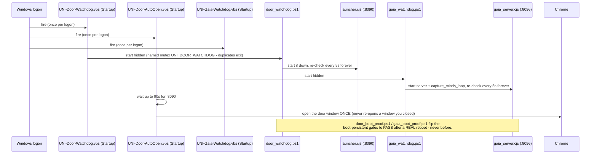
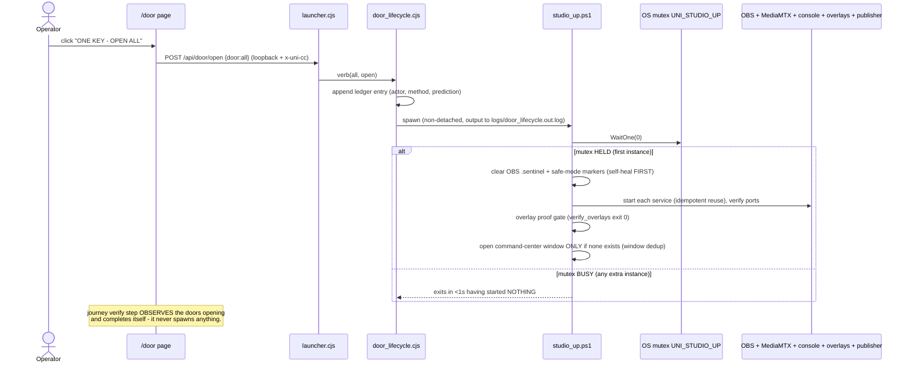
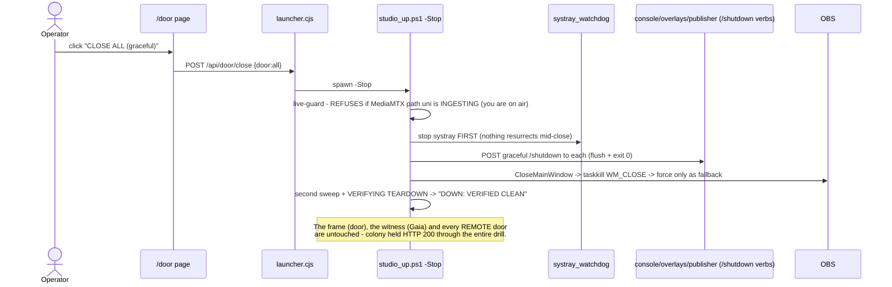
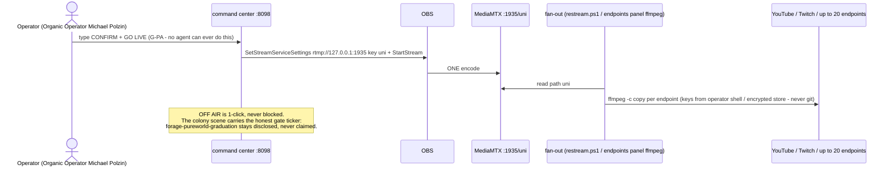

# Door lifecycle — the full sequence diagrams (2026-07-14)

> The complete message-flow of the door system: boot, one-key open, graceful close, the journey,
> go-live, and — because receipts beat rhetoric — the two spawn-storm incidents and the breakers
> that make their whole class structurally impossible now. Live counterpart: **the living map** on
> `http://127.0.0.1:8090/door` (renders these same actors from `/api/door/state` + `/api/door/journey`
> every 3s). Gaia projects the underlying register + journey files verbatim
> (`studio.doors.register`, `studio.doors.journey`).

## 1. Logon / boot — how the door and witness return with zero clicks



## 2. ONE KEY — opening the studio (always a deliberate click)



## 3. Graceful close — the shutdown button



## 4. The journey — reboot-surviving vectors (reads never actuate)

```mermaid
sequenceDiagram
    actor O as Operator
    participant D as /door page (3s poll)
    participant J as door_journey.cjs (state on disk)
    participant OS as Windows

    Note over J: studio_ready -> feature_test -> go_live -> run_of_show -> off_air<br/>(the two-reboot ceremony was RETIRED 2026-07-15; reboot is runtime STATE, not a step)
    D->>J: GET /api/door/journey (pure read)
    J->>J: arm current step SYNCHRONOUSLY (un-interleavable - the race fix)
    J->>OS: measure (ports+spool for studio_ready, broadcast_test.go, streaming, on-air clock)
    J-->>D: step status + honest live detail
    O->>OS: type CONFIRM + GO LIVE in the console (G-PA) — the journey can only WATCH for it
    OS-->>J: streaming==true -> go_live completes; sawLive + liveStartedAt PERSISTED (2026-07-17)
    Note over J: run_of_show measures the on-air clock vs the slot duration;<br/>off_air completes when streaming stops after sawLive (survives a mid-show restart)
    Note over D,J: LAW (burned in 2026-07-14): a polled READ never spawns anything.<br/>Every actuation is a deliberate operator click or an explicit verb.
```

## 5. Go-live — the key that stays human



## Appendix — the two spawn storms and their breakers (honest incident record)

```mermaid
sequenceDiagram
    participant T as /door tabs (3s polls)
    participant J as journey verify (OLD, buggy)
    participant SU as studio_up (xN, stacking)
    participant OBS as OBS + cc windows (xN)

    Note over T,OBS: STORM (2026-07-14): the verify step auto-triggered ONE KEY,<br/>and the race fix discarded its once-only guard -> every 3s poll spawned<br/>studio_up -> OBS + a NEW command-center window. Dozens stacked.
    T->>J: GET journey (every 3s, every tab)
    J->>SU: doors.verb(all, open)  [BUG: side-effect in a read]
    SU->>OBS: start OBS + pop cc window (8b was unconditional)
    Note over T,OBS: BREAKERS NOW (three independent layers):<br/>1. reads never actuate - verify steps are pure observers (d09f700)<br/>2. one bring-up at a time - OS mutex UNI_STUDIO_UP inside studio_up itself<br/>3. idempotent windows - cc window opens only if none exists for its profile<br/>Any one alone stops the storm; all three are in.
```

**Receipts:** `docs/receipts/stability_audit_2026-07-14.md` (Class A drill outputs) ·
gate rows `door-lifecycle-circle`, `door-boot-persistent`, `door-storm-breakers` in `evidence/gates.ndjson`.
